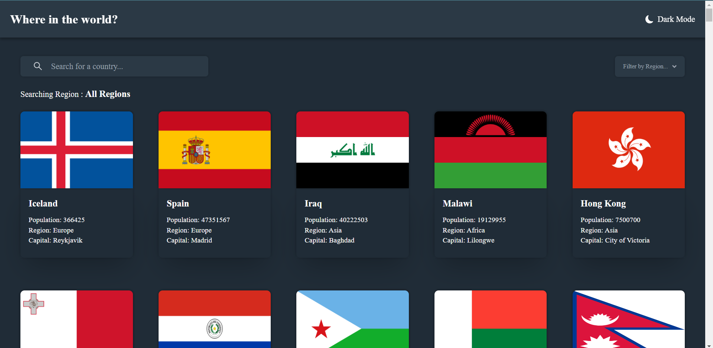
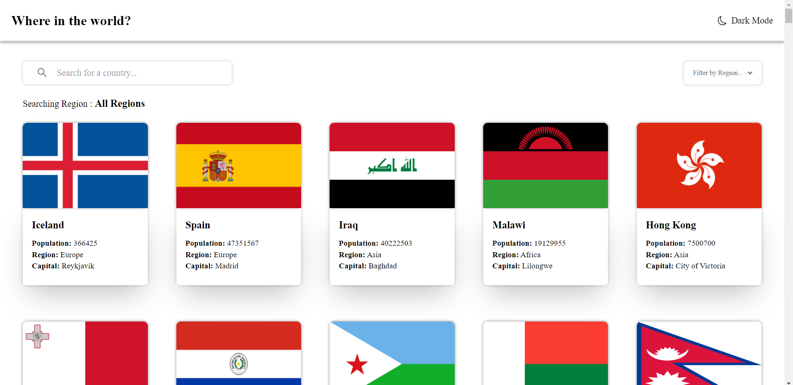

# Frontend Mentor - REST Countries API with color theme switcher solution

This is a solution to the [REST Countries API with color theme switcher challenge on Frontend Mentor](https://www.frontendmentor.io/challenges/rest-countries-api-with-color-theme-switcher-5cacc469fec04111f7b848ca). Frontend Mentor challenges help you improve your coding skills by building realistic projects.

## Table of contents

- [Overview](#overview)
  - [The challenge](#the-challenge)
  - [Screenshot](#screenshot)
  - [Links](#links)
- [My process](#my-process)
  - [Built with](#built-with)
  - [What I learned](#what-i-learned)
- [Author](#author)

## Overview

### The challenge

Users should be able to:

- See all countries from the API on the homepage
- Search for a country using an `input` field
- Filter countries by region
- Click on a country to see more detailed information on a separate page
- Click through to the border countries on the detail page
- Toggle the color scheme between light and dark mode _(optional)_

### Screenshot






### Links

- Solution URL: [GitHub](https://github.com/Sri1729/CountryViewer)
- Live Site URL: [GitHub Pages](https://sri1729.github.io/CountryViewer/)

## My process

### Built with

- Semantic HTML5 markup
- CSS custom properties
- Mobile-first workflow
- Static Generation
- [React](https://reactjs.org/)
- [Next.js](https://nextjs.org/) - React framework
- [Tailwind Css](https://tailwindcss.com/) - For styles
- [MobX](https://mobx.js.org/README.html) - For State Management

### What I learned

```html
<h1>Toggle between dark and light mode</h1>
```

```js
const proudOfThisFunc = () => {
  console.log("Static generation using Next and MobX");
};
```

## Author

- Frontend Mentor - [@Sriram Chamarthy](https://www.frontendmentor.io/profile/Sri1729)
- HackerRank - [sriram2491999]("https://www.hackerrank.com/sriram2491999)
- LinkedIn - [Sriram Chamarthy]("https://www.linkedin.com/in/sriram-chamarthy-063177146/")
